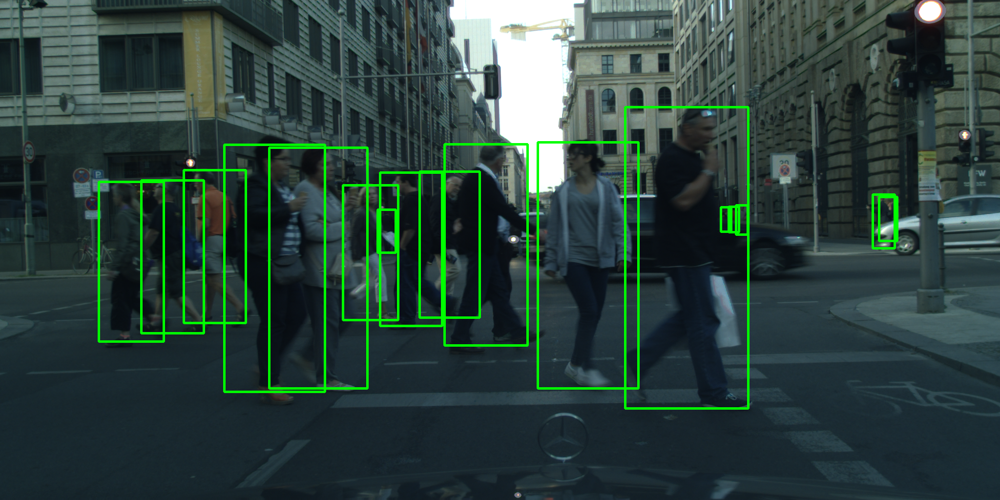
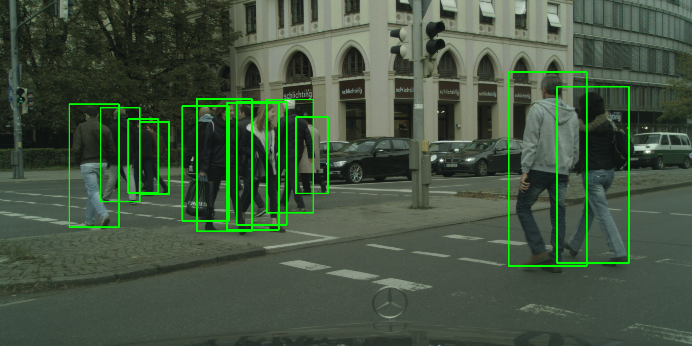
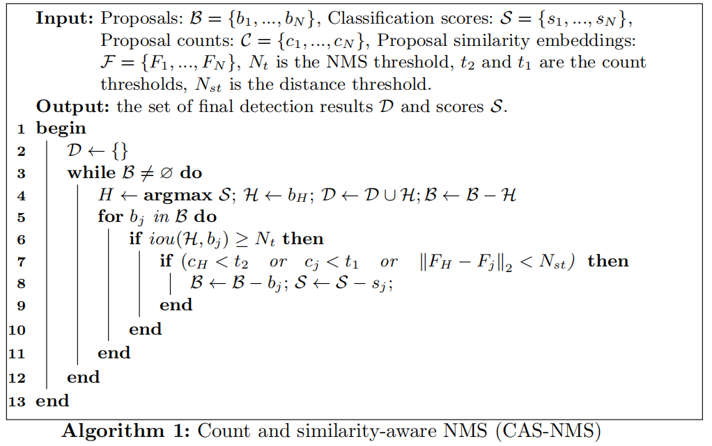

# Count- and Similarity-aware RCNN for Pedestrian Detection
Pedestrian detection framework as detailed in [paper], accepted to ECCV 2020.

<table>
    <tr>
        <td ><center></center></td>
        <td ><center></center></td>
    </tr>
</table>

## Introduction
Recent pedestrian detection methods generally rely on additional supervision, such as visible bounding-box annotations, to handle heavy occlusions. We propose an approach that leverages pedestrian count and proposal similarity information within a two-stage pedestrian detection framework. Both pedestrian count and proposal similarity are derived from standard full-body annotations commonly used to train pedestrian detectors. We introduce a count-weighted detection loss function that assigns higher weights to the detection errors occurring at highly overlapping pedestrians. The proposed loss function is utilized at both stages of the two-stage detector. We further introduce a count-and-similarity branch within the two-stage detection framework, which predicts pedestrian count as well as proposal similarity. Lastly, we introduce a count and similarity-aware NMS strategy to identify distinct proposals. Our approach requires neither part information nor visible bounding-box annotations. 


## Detals of CAS-NMS
<div align="center">
  
</div>

## Installation
```
pip install -r requirements.txt
python setup.py develop
```

## Prepare datasets
It is recommended to symlink the dataset root to $CaSe/data.
You can download [CityScapes Datasets](https://www.cityscapes-dataset.com/).Put it in data folder.

```
CaSe
├── data
│   ├── cityscapes
│   │   ├── leftImg8bit
│   │   │   ├── train
│   │   │   ├── val
```

##  Evaluation
```shell
./tools/dist_test.sh ${CONFIG_FILE} ${CHECKPOINT_FILE} ${GPU_NUM}
```
- CONFIG_FILE about CaSe is in [configs](configs).

##  Image demo
We provide a demo script to test a single image.

```shell
python tools/demo.py ${IMAGE_FILE} ${CONFIG_FILE} ${CHECKPOINT_FILE}
```

## Results
Methods |Training Sets|Backbnones|Input Scales| R        | HO     | Configs|                                                            Download                                                              |
|:-----------------: |:-----------:|:--------:| :----:     |:-------:| :----: | :------------------------------------: | :---------------------------------------------------------------------------------------------------------------------------------------------------------------------: |
CaSe                 |visiblity ≥30| VGG      |  1.3x      | 9.4     |36.2    |[config](configs/case_vgg_13x.py)       | [Model](https://drive.google.com/file/d/1MdKHM-XkJ5WRF46wsoD9fuU22UrYWkg3/view?usp=sharing)|

### Different backbone networks
Methods |Training Sets|Backbnones|Input Scales| R        | HO     | Configs|                                                            Download                                                              |
|:-----------------: |:-----------:|:--------:| :----:     |:-------:| :----: | :------------------------------------: | :---------------------------------------------------------------------------------------------------------------------------------------------------------------------: |
CaSe                 |visiblity ≥65| R50      |  1.0x      | 10.5    |47.4    |[config](configs/case_r50_10x.py)       | [Model](https://drive.google.com/file/d/18BdHfGyXWmSkHMdDwux_BZSVIW_33dJD/view?usp=sharing)|
CaSe                 |visiblity ≥65| DLA      |  1.0x      | 8.0     |42.1    |[config](configs/case_dla_10x.py)       | [Model](https://drive.google.com/file/d/18nP8zVb5n8AXOC-OuU8pWi9CfDP5euMm/view?usp=sharing)|

### Combine with other methods
Methods              |Training Sets|Backbnones|Input Scales| R       | HO     | Configs                                |                                                            Download                                                              |
|:-----------------: |:-----------:|:--------:| :----:     |:-------:| :----: | :------------------------------------: | :---------------------------------------------------------------------------------------------------------------------------------------------------------------------: |
CaSe+PedHunter       |visiblity ≥65| VGG      |  1.3x      | 7.8     |40.2    |[config](configs/case_pedhunter_13x.py) | [Model](https://drive.google.com/file/d/1JURDvAWbLeDPYjajYB9BAlhBROT7Fdmo/view?usp=sharing)|
CaSe+CascadeRCNN     |visiblity ≥65| VGG      |  1.0x      | 9.4     |46.1    |[config](configs/case_cascadercnn_10x.py) | [Model](https://drive.google.com/file/d/1TYTnuff_744YaeyauYyBCoP9PE3wy2Fd/view?usp=sharing)|
CaSe+MGAN            |visiblity ≥65| VGG      |  1.0x      | 10.3    |48.7    |confiig| Model|


## Ciatation
If the project helps your research, please cite this paper.

```
@InProceedings{Xie_CaSe_ECCV_2020,
  author =       {Jin Xie and Hisham Cholakkal and Rao Muhammad Anwer and Fahad Shahbaz Khan and Yanwei Pang and Ling Shao and Mubarak Shah},
  title =        {Count- and Similarity-aware RCNN for Pedestrian Detection},
  booktitle =    {The European Conference on Computer Vision (ECCV)},
  year =         {2020}
}
```

## Acknowledgement
Many thanks to the open source codes, i.e., [mmdetection](https://github.com/open-mmlab/mmdetection).